# Architecture

## System Overview

Agent Stop and Go is a modular Go application that connects an LLM to external tools (MCP) and remote agents (A2A), with an approval gateway for destructive operations. The system supports two operating modes: **simple mode** (single LLM with tools) and **orchestrated mode** (tree-based agent pipelines).

## High-Level Architecture

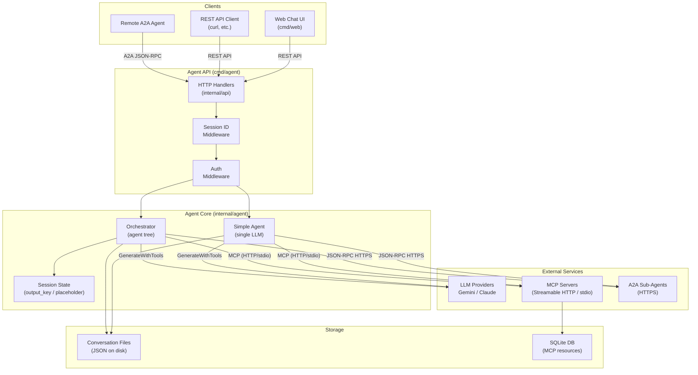

## Package Responsibilities

| Package | Path | Responsibility |
|---------|------|----------------|
| `api` | `internal/api/` | Fiber HTTP handlers, route setup, A2A server (JSON-RPC dispatch), interactive HTML docs |
| `agent` | `internal/agent/` | Core agent logic: LLM interaction, MCP tool calls, A2A delegation, orchestration engine with sequential/parallel/loop execution |
| `llm` | `internal/llm/` | Multi-provider LLM interface. `GeminiClient` calls the Google Generative Language API. `ClaudeClient` calls the Anthropic Messages API. Both use a 60-second HTTP timeout. |
| `mcp` | `internal/mcp/` | MCP client with multi-server support. `CompositeClient` aggregates tools from multiple MCP servers (HTTP or stdio) and routes `CallTool` to the correct sub-client. Handles `initialize`, `tools/list`, and `tools/call`. |
| `filesystem` | `internal/filesystem/` | MCP filesystem server implementation. Provides 15 sandboxed filesystem tools with chroot-like security (symlink-aware path validation), per-root tool allowlists, unified diff patching, regex content search (grep), and glob file search. |
| `a2a` | `internal/a2a/` | A2A client: JSON-RPC 2.0 over HTTPS to remote agents. Supports `message/send`, `tasks/get`, and `ContinueTask` (approval forwarding). |
| `auth` | `internal/auth/` | Context-based propagation of Bearer tokens and session IDs. Provides `WithBearerToken()`, `BearerToken()`, `WithSessionID()`, `SessionID()`, and `GenerateSessionID()`. |
| `config` | `internal/config/` | YAML config loader. Parses agent configuration including MCP, LLM, A2A, and orchestration tree settings. Applies defaults for missing fields. |
| `conversation` | `internal/conversation/` | Data models: `Conversation`, `Message`, `ToolCall`, `PendingApproval`, `PipelineState`. Thread-safe message operations via `sync.Mutex`. |
| `storage` | `internal/storage/` | JSON file persistence. Saves/loads conversations, searches by approval UUID. Thread-safe via `sync.RWMutex`. |

## Component Interaction Diagram

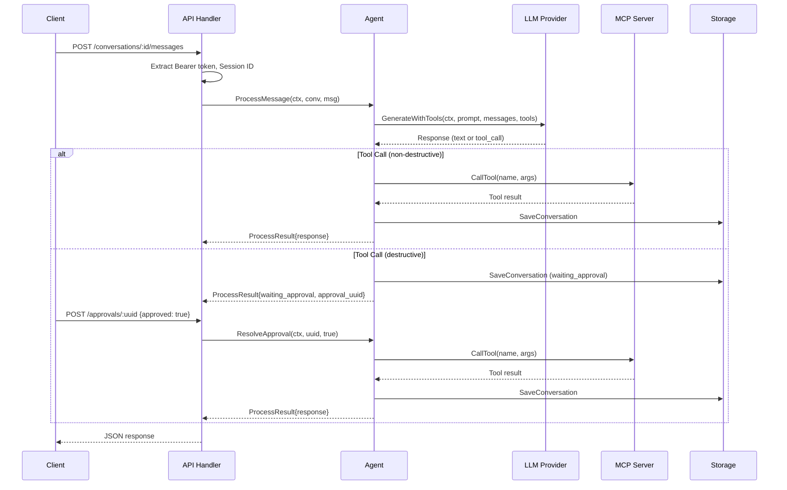

## Data Models

### Conversation

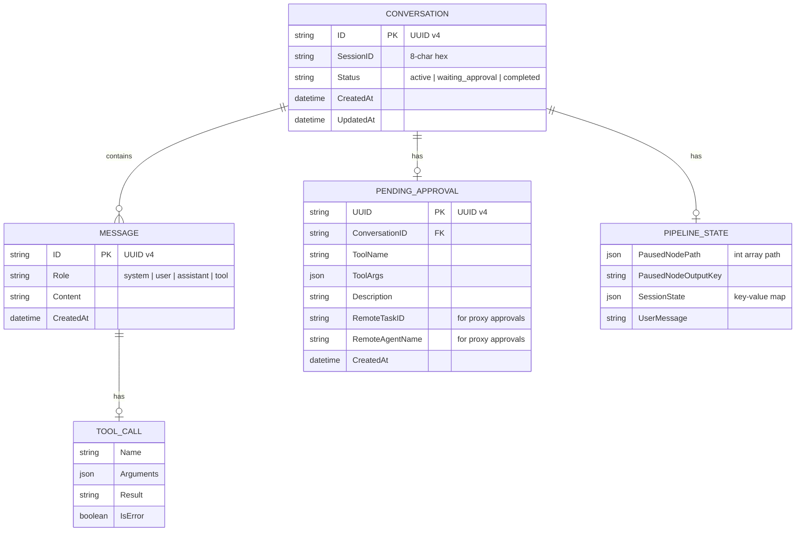

### MCP Resource (SQLite)

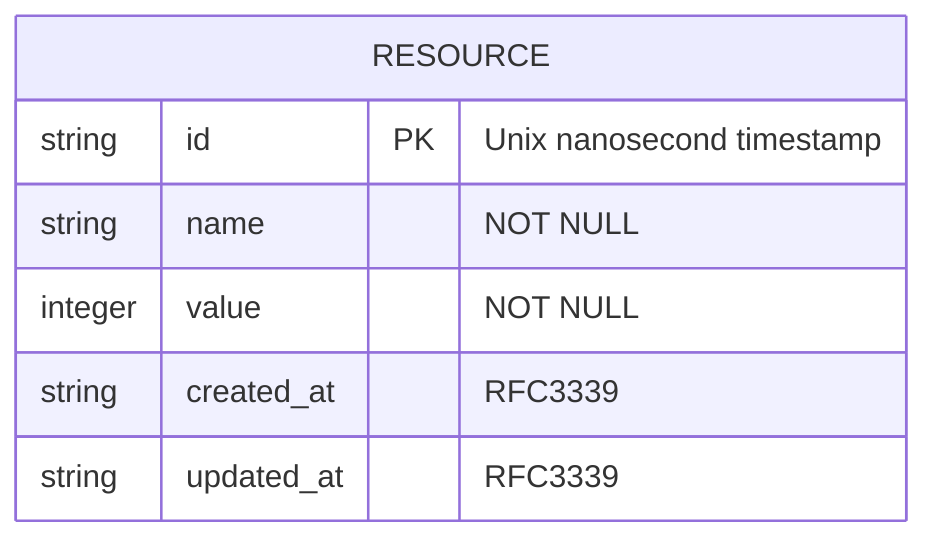

## Operating Modes

### Simple Mode (Single LLM)

When the `agent` key is absent from the YAML config (or is a single `llm` node with no children), the agent runs in backward-compatible simple mode:

1. User message is sent to the LLM with all MCP tools and A2A agents as available functions
2. The LLM decides which tool/agent to call (or responds with text)
3. Destructive tools trigger the approval workflow
4. Non-destructive tools execute immediately

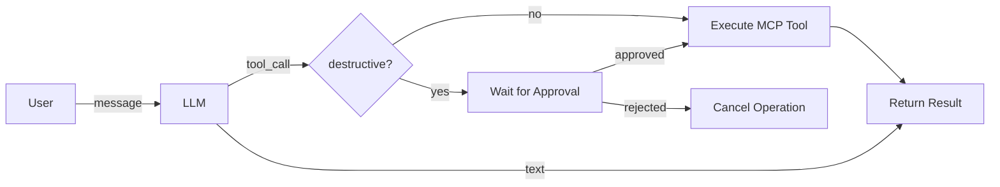

### Orchestrated Mode (Agent Tree)

When the `agent` key is present in config, the tree-based orchestrator is used. The tree defines a directed acyclic graph of execution nodes.

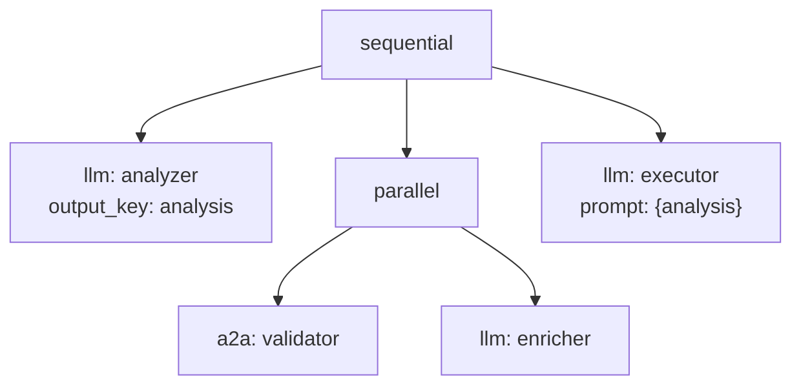

**Node Types:**

| Type | Behavior | Approval Handling |
|------|----------|-------------------|
| `sequential` | Runs children in order | Pauses pipeline, resumes after approval |
| `parallel` | Runs children concurrently | Destructive tools execute immediately |
| `loop` | Repeats children until exit or max iterations | Destructive tools execute immediately |
| `llm` | Calls LLM with MCP + optional A2A tools | Depends on parent context |
| `a2a` | Delegates to remote A2A agent | Depends on parent context |

## Session State and Data Flow

Nodes communicate through a shared `SessionState` map:

1. A node sets `output_key: analysis` to store its output under the key `analysis`
2. A downstream node uses `prompt: "Based on {analysis}"` to read that value
3. Placeholders are resolved at execution time via regex replacement

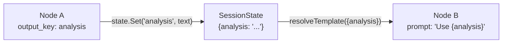

The `SessionState` is thread-safe (protected by `sync.RWMutex`) to support parallel execution.

## A2A Protocol Flow

### Outbound (Client)

A2A agents appear as synthetic tools to the LLM, prefixed with `a2a_`. The LLM naturally selects between MCP tools and A2A agents.

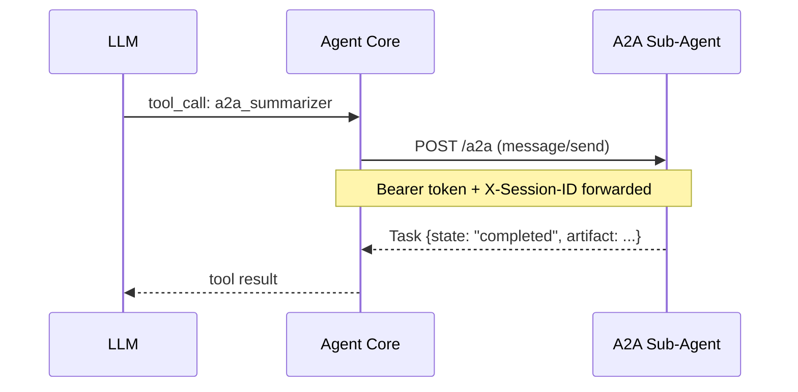

### Inbound (Server)

The agent also exposes itself as an A2A server:

- `GET /.well-known/agent.json` returns the Agent Card (name, skills)
- `POST /a2a` accepts JSON-RPC 2.0 calls (`message/send`, `tasks/get`)
- Task ID = Conversation ID (1:1 mapping)

### Proxy Approval Chain

When Agent A delegates to Agent B, and Agent B encounters a destructive tool:

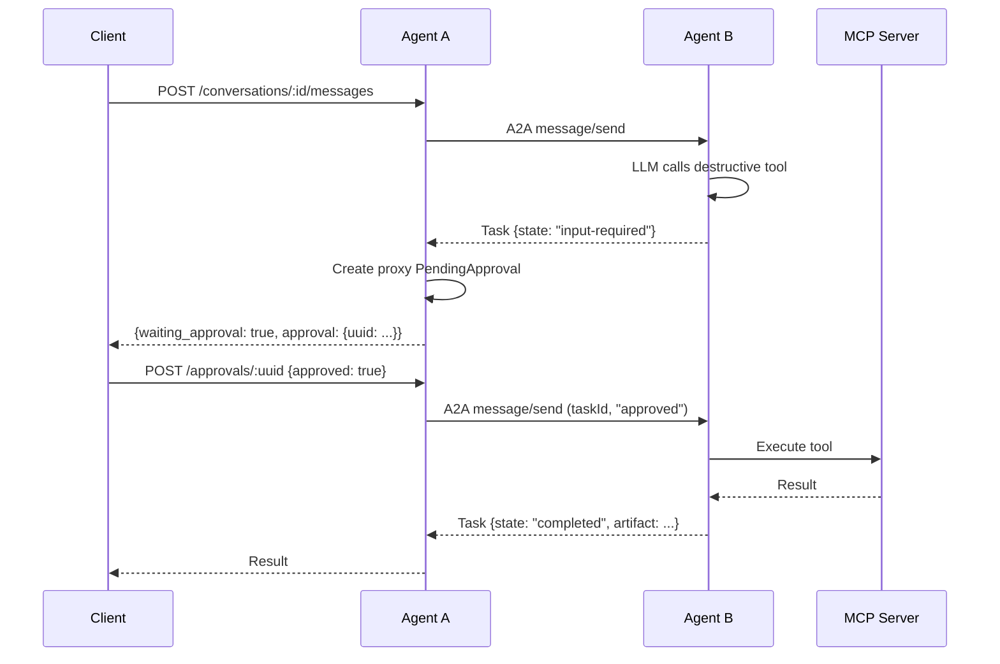

## Session ID Propagation

Session IDs enable cross-agent request tracing in distributed deployments.

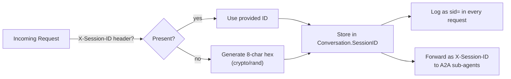

## Auth Flow

Bearer tokens flow through the entire agent chain, enabling end-to-end authentication without the agent needing to understand the token content.

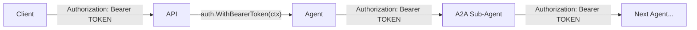

## Key Design Decisions

1. **JSON-RPC 2.0 everywhere**: Both MCP (over Streamable HTTP or stdio) and A2A (over HTTPS) use the same protocol format, simplifying the codebase and enabling consistent error handling.

2. **Tools as first-class LLM functions**: A2A agents appear as synthetic tools alongside MCP tools. The LLM makes the routing decision, not the application code.

3. **Approval is a conversation state**: The `PendingApproval` is stored on the `Conversation` object. This keeps the approval workflow stateless from the server's perspective -- the conversation file is the single source of truth.

4. **Pipeline pause/resume via serialized state**: When an orchestrated pipeline pauses for approval, the entire session state and execution path are serialized into `PipelineState`. On resume, the orchestrator fast-forwards to the paused node.

5. **Multi-MCP server support**: Multiple MCP servers (HTTP or stdio) can be configured under `mcp_servers`. A `CompositeClient` aggregates tools from all servers and routes calls to the correct sub-client, keeping tool implementation isolated and language-agnostic.

6. **Lazy LLM client creation**: In orchestrated mode, different nodes can use different LLM models. Clients are created on first use and cached in a thread-safe map, avoiding unnecessary API key validation for unused providers.
