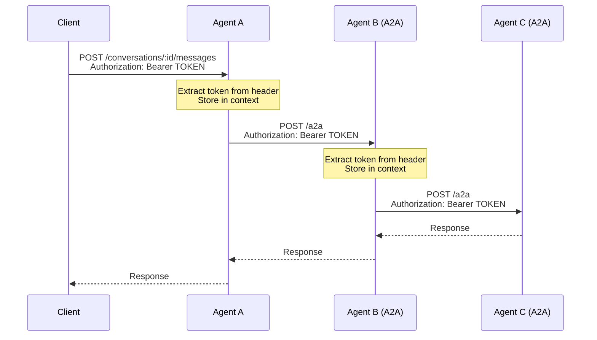
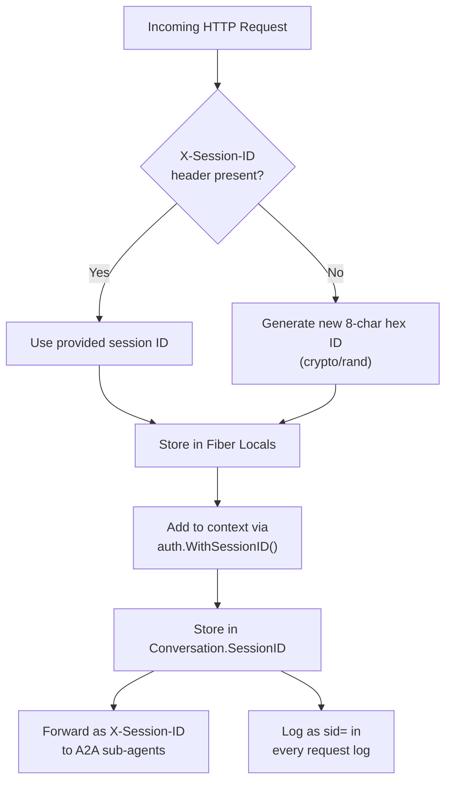
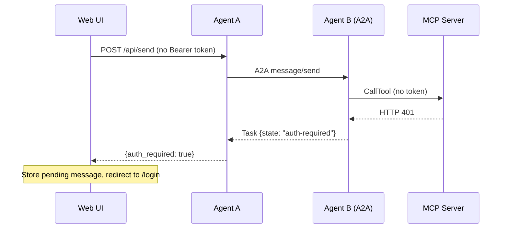

# Authentication and Authorization

Agent Stop and Go implements a **pass-through authentication model**. The agent itself does not verify or validate tokens. Instead, it extracts Bearer tokens from incoming requests and forwards them to downstream A2A agents. This enables end-to-end authentication across multi-agent chains without requiring the agent framework to understand token semantics.

## Authentication Mechanism

### Bearer Token Forwarding

The authentication flow uses standard HTTP `Authorization: Bearer` headers:



### Implementation

The auth system is implemented in `internal/auth/auth.go` using Go context values.

**Context propagation functions:**

| Function | Description |
|----------|-------------|
| `WithBearerToken(ctx, token)` | Stores a Bearer token in the context |
| `BearerToken(ctx)` | Retrieves the Bearer token from the context (empty string if none) |
| `WithSessionID(ctx, id)` | Stores a session ID in the context |
| `SessionID(ctx)` | Retrieves the session ID from the context (empty string if none) |
| `GenerateSessionID()` | Creates a new 8-char hex session ID using `crypto/rand` |

**Context key types** use unexported empty structs to avoid collisions:

```go
type bearerKey struct{}
type sessionIDKey struct{}
```

### Token Extraction

The API handler extracts the Bearer token at the HTTP layer:

```go
func extractContext(c *fiber.Ctx) context.Context {
    ctx := context.Background()
    authHeader := c.Get("Authorization")
    if strings.HasPrefix(authHeader, "Bearer ") {
        token := strings.TrimPrefix(authHeader, "Bearer ")
        ctx = auth.WithBearerToken(ctx, token)
    }
    if sid, ok := c.Locals("session_id").(string); ok && sid != "" {
        ctx = auth.WithSessionID(ctx, sid)
    }
    return ctx
}
```

### Token Forwarding to A2A Agents

The A2A client reads the token from the context and adds it to outbound requests:

```go
// In internal/a2a/client.go
if token := auth.BearerToken(ctx); token != "" {
    httpReq.Header.Set("Authorization", "Bearer "+token)
}
if sid := auth.SessionID(ctx); sid != "" {
    httpReq.Header.Set("X-Session-ID", sid)
}
```

This forwarding happens in every A2A call: `SendMessage`, `ContinueTask`, and `FetchAgentCard`.

### Token Forwarding to MCP Servers

The MCP HTTP client (`internal/mcp/client_http.go`) also forwards Bearer tokens to MCP servers. The `CallTool` method accepts a `context.Context` and uses `mcp-go`'s `WithHTTPHeaderFunc` to dynamically inject the `Authorization` header on every HTTP request:

```go
// In internal/mcp/client_http.go
transport.WithHTTPHeaderFunc(func(ctx context.Context) map[string]string {
    headers := map[string]string{}
    if token := auth.BearerToken(ctx); token != "" {
        headers["Authorization"] = "Bearer " + token
    }
    return headers
})
```

This enables MCP servers (e.g., `https://contacts.mcp.scm-platform.org`) to validate OAuth2 tokens and authorize tool calls. If an MCP server returns HTTP 401, the agent surfaces this as `auth_required` in the REST API response (see [Auth-Required Propagation](#auth-required-propagation) below).

**Note:** The stdio transport (`StdioClient`) does not support HTTP headers. Token forwarding only applies to MCP servers using Streamable HTTP transport.

## Authorization Model

Agent Stop and Go does not implement its own authorization logic. The authorization model depends entirely on what the downstream services (A2A agents, identity providers) do with the forwarded token.

### Intended Usage Patterns

**Pattern 1: Identity Provider + Token Validation at the Edge**

```
Client (with JWT from IdP) --> Agent A (forwards token) --> Agent B (validates token)
```

Each downstream agent validates the token against the identity provider. The agent framework merely propagates the token.

**Pattern 2: API Gateway with Pre-Validated Tokens**

```
API Gateway (validates JWT) --> Agent A (token already validated) --> Agent B
```

The API gateway handles authentication before the request reaches the agent. The agent forwards the token for audit and downstream access control.

**Pattern 3: Internal Service Mesh (No Auth)**

For internal deployments where all agents are in a trusted network, no Bearer token is needed. The auth forwarding is a no-op when no token is present.

## Session ID Tracing

Every conversation is assigned an 8-character hex session ID for cross-agent request correlation. This is separate from authentication but related to observability.

### Session ID Lifecycle



### Session ID Middleware

The Fiber middleware extracts or generates the session ID before any handler runs:

```go
app.Use(func(c *fiber.Ctx) error {
    sid := c.Get("X-Session-ID")
    if sid == "" {
        sid = auth.GenerateSessionID()
    }
    c.Locals("session_id", sid)
    return c.Next()
})
```

### Log Format

Every request log includes the session ID:

```
16:23:45 | 200 | 1.234s | POST | /conversations/abc/messages | sid=a1b2c3d4
```

This format enables log correlation across multiple agents in a Docker Compose deployment:

```bash
# Find all requests for session a1b2c3d4 across all agents
grep "sid=a1b2c3d4" logs/*
```

### Custom Session IDs

Clients can provide their own session ID to trace a specific workflow:

```bash
curl -X POST http://localhost:8080/conversations \
  -H "X-Session-ID: mytest01" \
  -d '{"message": "list resources"}'
```

This ID will propagate to all downstream A2A agents.

## Auth-Required Propagation

When an MCP server returns HTTP 401 (Unauthorized), the error propagates through the full agent chain back to the caller:

1. **MCP HTTP Client** detects 401 and returns an `AuthRequiredError`
2. **Agent** catches the typed error and sets `ProcessResult.AuthRequired = true`
3. **REST API** returns the response with `"auth_required": true` in the JSON body
4. **A2A Server** returns a task with `state: "auth-required"` to the calling agent
5. **Upstream agents** propagate the `auth-required` state through the A2A chain



The `auth-required` state is distinct from `input-required` (approval): no pending state is stored in intermediate agents. The entire message is replayed from scratch after authentication.

## Web UI OAuth2 Flow

The web chat frontend (`cmd/web`) supports an optional OAuth2 authorization code flow for obtaining Bearer tokens on-demand.

### On-Demand Authentication

Users can chat without logging in. Authentication is triggered only when an MCP tool returns HTTP 401:

1. Agent returns `auth_required: true` to the web UI
2. JavaScript stores the pending message in browser `sessionStorage`
3. User is redirected to the OAuth2 provider (e.g., Google) for consent
4. After consent, the provider redirects to `/callback` with an authorization code
5. Web server exchanges the code for tokens and creates a server-side session in SQLite
6. User is redirected back to the chat page
7. JavaScript detects the pending message and auto-retries with the new Bearer token

### Session Management

- **Storage**: SQLite database at `<data_dir>/sessions.db` using `modernc.org/sqlite` (pure Go, no CGO)
- **Cookie**: `asg_session` — `HttpOnly`, `SameSite=Lax`, `Secure` (on non-localhost), `Max-Age=30d`
- **Token refresh**: Automatic refresh with 60-second buffer before expiry. If refresh fails, the session is deleted and a new OAuth2 flow is triggered.
- **Logout**: `POST /logout` revokes the token at Google (best-effort), deletes the session, clears the cookie

### Infinite Loop Protection

If the auto-retry after OAuth2 flow still triggers `auth_required` (wrong scopes, wrong account), the JavaScript detects the loop (via `X-Auth-Retry` header) and shows an error instead of redirecting again.

### Configuration

The OAuth2 flow is enabled by adding an `oauth2` section to `config/web.yaml`:

```yaml
data_dir: ./data
oauth2:
  client_id: "xxx.apps.googleusercontent.com"
  client_secret: "GOCSPX-xxx"
  auth_url: "https://accounts.google.com/o/oauth2/v2/auth"
  token_url: "https://oauth2.googleapis.com/token"
  revoke_url: "https://oauth2.googleapis.com/revoke"
  redirect_url: "http://localhost:8080/callback"
  scopes:
    - "openid"
    - "https://www.googleapis.com/auth/contacts"
```

If the `oauth2` section is absent, the web server starts without OAuth2 support (backward compatible). Auth-related routes return 404 and `auth_required` responses are displayed as plain error messages.

## Security Considerations

### Token Handling

- Tokens stored in Go context (memory) during request processing are never persisted to conversation files
- Tokens are not logged or included in API responses
- Tokens are forwarded over HTTPS connections (A2A agents, MCP servers)
- OAuth2 tokens in the web UI are stored server-side in SQLite — the browser never sees them

### MCP Server Security

MCP servers (`mcp-resources`, `mcp-filesystem`, or custom) can run in two modes:

- **Streamable HTTP** (preferred): Runs as a standalone HTTP service. Bearer tokens from incoming requests are forwarded to MCP HTTP servers via the `Authorization` header, enabling external MCP servers to validate OAuth2 tokens and authorize tool calls.
- **stdio** (legacy): Runs as a subprocess of the agent. It communicates exclusively via stdin/stdout and has no network exposure. Bearer tokens cannot be forwarded over stdio.

Internal MCP servers (like `mcp-resources` and `mcp-filesystem`) ignore the forwarded token. External MCP servers that require OAuth2 authentication (e.g., Google Contacts MCP) validate the token and return HTTP 401 if it is missing or invalid.

The `mcp-filesystem` server provides additional security through its sandboxing model: each root directory is chroot-isolated with symlink-aware path validation, and per-root tool allowlists control which operations are permitted. See [Functionalities](functionalities.md#built-in-mcp-server-mcp-filesystem) for details.

### Docker Security

- The runtime Docker container runs as a non-root user (`appuser`, UID 10001)
- The Dockerfile creates a dedicated user (`appuser:appuser`)
- The user has no home directory and no login shell (`/sbin/nologin`)
- The runtime image is `alpine:3.21` with only `ca-certificates` installed (for HTTPS connections)

### Secrets Management

- API keys (`GEMINI_API_KEY`, `ANTHROPIC_API_KEY`) are passed via environment variables
- In Docker Compose, environment variables are set at the service level
- For production, use a secrets manager or Docker secrets

> **Warning**: Never commit API keys to the repository. Use environment variables or a `.env` file (which is gitignored).

### No Built-in Authentication

The agent API itself has **no authentication**. Any client can:

- Create conversations
- Send messages
- Approve/reject pending actions
- Access the A2A endpoint

For production deployments, place an API gateway or reverse proxy in front of the agent to handle authentication and rate limiting.
