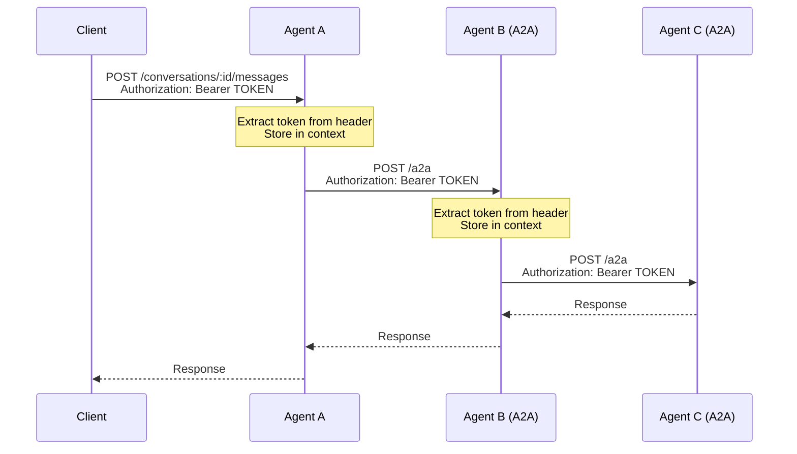
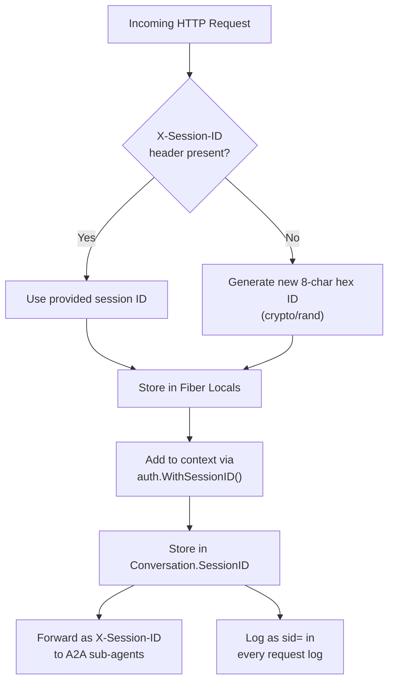

# Authentication and Authorization

Agent Stop and Go implements a **pass-through authentication model**. The agent itself does not verify or validate tokens. Instead, it extracts Bearer tokens from incoming requests and forwards them to downstream A2A agents. This enables end-to-end authentication across multi-agent chains without requiring the agent framework to understand token semantics.

## Authentication Mechanism

### Bearer Token Forwarding

The authentication flow uses standard HTTP `Authorization: Bearer` headers:



### Implementation

The auth system is implemented in `internal/auth/auth.go` using Go context values.

**Context propagation functions:**

| Function | Description |
|----------|-------------|
| `WithBearerToken(ctx, token)` | Stores a Bearer token in the context |
| `BearerToken(ctx)` | Retrieves the Bearer token from the context (empty string if none) |
| `WithSessionID(ctx, id)` | Stores a session ID in the context |
| `SessionID(ctx)` | Retrieves the session ID from the context (empty string if none) |
| `GenerateSessionID()` | Creates a new 8-char hex session ID using `crypto/rand` |

**Context key types** use unexported empty structs to avoid collisions:

```go
type bearerKey struct{}
type sessionIDKey struct{}
```

### Token Extraction

The API handler extracts the Bearer token at the HTTP layer:

```go
func extractContext(c *fiber.Ctx) context.Context {
    ctx := context.Background()
    authHeader := c.Get("Authorization")
    if strings.HasPrefix(authHeader, "Bearer ") {
        token := strings.TrimPrefix(authHeader, "Bearer ")
        ctx = auth.WithBearerToken(ctx, token)
    }
    if sid, ok := c.Locals("session_id").(string); ok && sid != "" {
        ctx = auth.WithSessionID(ctx, sid)
    }
    return ctx
}
```

### Token Forwarding to A2A Agents

The A2A client reads the token from the context and adds it to outbound requests:

```go
// In internal/a2a/client.go
if token := auth.BearerToken(ctx); token != "" {
    httpReq.Header.Set("Authorization", "Bearer "+token)
}
if sid := auth.SessionID(ctx); sid != "" {
    httpReq.Header.Set("X-Session-ID", sid)
}
```

This forwarding happens in every A2A call: `SendMessage`, `ContinueTask`, and `FetchAgentCard`.

## Authorization Model

Agent Stop and Go does not implement its own authorization logic. The authorization model depends entirely on what the downstream services (A2A agents, identity providers) do with the forwarded token.

### Intended Usage Patterns

**Pattern 1: Identity Provider + Token Validation at the Edge**

```
Client (with JWT from IdP) --> Agent A (forwards token) --> Agent B (validates token)
```

Each downstream agent validates the token against the identity provider. The agent framework merely propagates the token.

**Pattern 2: API Gateway with Pre-Validated Tokens**

```
API Gateway (validates JWT) --> Agent A (token already validated) --> Agent B
```

The API gateway handles authentication before the request reaches the agent. The agent forwards the token for audit and downstream access control.

**Pattern 3: Internal Service Mesh (No Auth)**

For internal deployments where all agents are in a trusted network, no Bearer token is needed. The auth forwarding is a no-op when no token is present.

## Session ID Tracing

Every conversation is assigned an 8-character hex session ID for cross-agent request correlation. This is separate from authentication but related to observability.

### Session ID Lifecycle



### Session ID Middleware

The Fiber middleware extracts or generates the session ID before any handler runs:

```go
app.Use(func(c *fiber.Ctx) error {
    sid := c.Get("X-Session-ID")
    if sid == "" {
        sid = auth.GenerateSessionID()
    }
    c.Locals("session_id", sid)
    return c.Next()
})
```

### Log Format

Every request log includes the session ID:

```
16:23:45 | 200 | 1.234s | POST | /conversations/abc/messages | sid=a1b2c3d4
```

This format enables log correlation across multiple agents in a Docker Compose deployment:

```bash
# Find all requests for session a1b2c3d4 across all agents
grep "sid=a1b2c3d4" logs/*
```

### Custom Session IDs

Clients can provide their own session ID to trace a specific workflow:

```bash
curl -X POST http://localhost:8080/conversations \
  -H "X-Session-ID: mytest01" \
  -d '{"message": "list resources"}'
```

This ID will propagate to all downstream A2A agents.

## Security Considerations

### Token Handling

- Tokens are stored only in the Go context (memory) and are never persisted to disk
- Tokens are not logged or included in conversation files
- Tokens are forwarded over the A2A HTTPS connection

### MCP Server Security

The MCP server (`mcp-resources`) can run in two modes:

- **Streamable HTTP** (preferred): Runs as a standalone HTTP service. In Docker Compose, it runs as a separate container on the internal network. It does not receive or process Bearer tokens.
- **stdio** (legacy): Runs as a subprocess of the agent. It communicates exclusively via stdin/stdout and has no network exposure.

In both cases, the MCP server does not participate in authentication -- Bearer tokens are not forwarded to MCP servers.

### Docker Security

- The runtime Docker container runs as a non-root user (`appuser`, UID 10001)
- The Dockerfile creates a dedicated user (`appuser:appuser`)
- The user has no home directory and no login shell (`/sbin/nologin`)
- The runtime image is `alpine:3.21` with only `ca-certificates` installed (for HTTPS connections)

### Secrets Management

- API keys (`GEMINI_API_KEY`, `ANTHROPIC_API_KEY`) are passed via environment variables
- In Docker Compose, environment variables are set at the service level
- For production, use a secrets manager or Docker secrets

> **Warning**: Never commit API keys to the repository. Use environment variables or a `.env` file (which is gitignored).

### No Built-in Authentication

The agent API itself has **no authentication**. Any client can:

- Create conversations
- Send messages
- Approve/reject pending actions
- Access the A2A endpoint

For production deployments, place an API gateway or reverse proxy in front of the agent to handle authentication and rate limiting.
