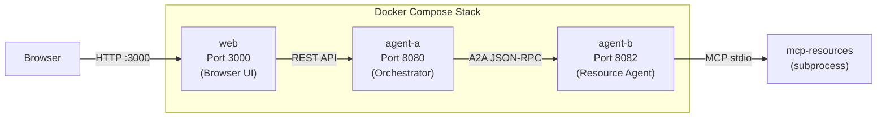

# Deployment

This document covers three deployment methods: local development, single-agent Docker, and multi-agent Docker Compose.

## Prerequisites

| Tool | Version | Required For |
|------|---------|-------------|
| Go | 1.23+ | Local development, building binaries |
| Make | any | Build automation |
| Docker | 20.10+ | Docker deployment |
| Docker Compose | v2+ | Multi-agent deployment |
| golangci-lint | latest | Linting (optional, falls back to `go vet`) |

### API Keys

At least one API key is required, depending on the LLM model configured:

| Variable | Required When |
|----------|--------------|
| `GEMINI_API_KEY` | Using Gemini models (default: `gemini-2.5-flash`) |
| `ANTHROPIC_API_KEY` | Using Claude models (model name starts with `claude-`) |

## Local Development

### Step 1: Set Environment Variables

```bash
export GEMINI_API_KEY=your-gemini-api-key
# or, for Claude models:
export ANTHROPIC_API_KEY=your-anthropic-api-key
```

### Step 2: Build

```bash
make build
```

This builds all three binaries for the current platform:

- `bin/agent-{os}-{arch}` -- Agent API server
- `bin/mcp-resources-{os}-{arch}` -- MCP resource server
- `bin/web-{os}-{arch}` -- Web chat frontend

### Step 3: Run the Agent

```bash
make run CMD=agent
```

The agent starts on `http://localhost:8080` using `config/agent.yaml`.

### Step 4 (Optional): Run the Web Frontend

In a separate terminal:

```bash
make run CMD=web
```

The web chat starts on `http://localhost:3000` using `config/web.yaml`.

### Custom Configuration

```bash
# Run agent with a custom config
./bin/agent-$(go env GOOS)-$(go env GOARCH) --config config/my-agent.yaml

# Or use an example config
cp examples/sequential/agent.yaml config/agent.yaml
make run CMD=agent
```

### Verify

```bash
# Health check
curl http://localhost:8080/health
# {"status":"ok"}

# List tools
curl http://localhost:8080/tools

# Interactive API docs
open http://localhost:8080/docs
```

## Docker: Single Agent

### Build the Docker Image

```bash
make docker
# or
docker build -t agent-stop-and-go .
```

The Dockerfile uses a multi-stage build:

1. **Build stage** (`golang:1.23-bookworm`): Compiles all Go binaries with CGO enabled (required for SQLite)
2. **Runtime stage** (`debian:bookworm-slim`): Minimal image with `ca-certificates` and a non-root user

### Run the Container

```bash
make docker-run
```

Or manually:

```bash
docker run --rm -p 8080:8080 \
  -e GEMINI_API_KEY=$GEMINI_API_KEY \
  agent-stop-and-go
```

### Custom Configuration

Mount a custom config file:

```bash
docker run --rm -p 8080:8080 \
  -e GEMINI_API_KEY=$GEMINI_API_KEY \
  -v $(pwd)/my-config.yaml:/app/config/agent.yaml \
  agent-stop-and-go
```

### Persistent Data

Mount a volume for conversation persistence:

```bash
docker run --rm -p 8080:8080 \
  -e GEMINI_API_KEY=$GEMINI_API_KEY \
  -v my-agent-data:/app/data \
  agent-stop-and-go
```

### Container Details

| Property | Value |
|----------|-------|
| Base image | `debian:bookworm-slim` |
| User | `appuser` (non-root) |
| Working directory | `/app` |
| Exposed port | 8080 |
| Default command | `/app/bin/agent --config /app/config/agent.yaml` |
| Binary locations | `/app/bin/agent`, `/app/bin/mcp-resources`, `/app/bin/web` |
| Config location | `/app/config/` |
| Data directory | `/app/data/` |

## Docker Compose: Multi-Agent Stack

The Docker Compose deployment runs a complete multi-agent architecture:



### Configuration Files

| File | Service | Description |
|------|---------|-------------|
| `config/agent-a.yaml` | agent-a | Orchestrator: delegates all resource operations to agent-b |
| `config/agent-b.yaml` | agent-b | Resource agent: runs MCP tools on port 8082 |
| `config/web-compose.yaml` | web | Web frontend: connects to agent-a at `http://agent-a:8080` |

### Start the Stack

```bash
export GEMINI_API_KEY=your-api-key
make compose-up
```

Or directly:

```bash
export GEMINI_API_KEY=your-api-key
docker-compose up --build
```

### Access Points

| Service | URL | Description |
|---------|-----|-------------|
| Web Chat | http://localhost:3000 | Browser-based chat interface |
| Agent A API | http://localhost:8080 | Orchestrator REST API |
| Agent A Docs | http://localhost:8080/docs | Interactive API documentation |

Agent B (port 8082) is internal to the Docker network and not exposed externally.

### Startup Order

Services start in dependency order:

1. **agent-b** starts first (no dependencies)
2. **agent-a** starts after agent-b (depends on agent-b)
3. **web** starts after agent-a (depends on agent-a)

### Log Correlation

All services write logs to the `./logs/` directory with a shared session prefix:

```bash
# Logs appear in ./logs/ with a timestamp prefix
logs/
├── 20260213_143022_a1b2c3d4_agent-a.log
├── 20260213_143022_a1b2c3d4_agent-b.log
└── 20260213_143022_a1b2c3d4_web.log
```

Session IDs (`sid=`) in logs enable cross-agent request tracing.

### Stop the Stack

```bash
make compose-down
# or
docker-compose down
```

### Docker Volumes

| Volume | Service | Purpose |
|--------|---------|---------|
| `agent-a-data` | agent-a | Persistent conversation storage |
| `agent-b-data` | agent-b | Persistent conversations + SQLite database |
| `./logs` | all | Shared log directory (bind mount) |

To clear all data:

```bash
docker-compose down -v
```

## Request Flow in Multi-Agent Deployment

### Non-Destructive Operation

```
Browser → POST /api/send ("list resources")
  → Web → POST /conversations (agent-a:8080)
    → Agent A → LLM: "list resources"
      → LLM calls a2a_resource-agent
        → Agent A → POST /a2a (agent-b:8082) message/send
          → Agent B → LLM: "list resources"
            → LLM calls resources_list
              → MCP → SQLite query
            ← Tool result
          ← A2A Task {state: "completed", artifact: ...}
        ← Agent A responds
      ← Result
    ← JSON response
  ← Browser displays result
```

### Destructive Operation with Proxy Approval

```
Browser → POST /api/send ("add resource X")
  → Agent A → Agent B (A2A)
    → Agent B: LLM calls resources_add (destructiveHint=true)
    ← A2A Task {state: "input-required"}
  ← Agent A creates proxy PendingApproval
  ← Browser shows approval prompt

Browser → POST /api/approve {uuid, approved: true}
  → Agent A → POST /a2a (agent-b:8082) message/send (taskId, "approved")
    → Agent B resolves approval → executes resources_add
    ← A2A Task {state: "completed", artifact: ...}
  ← Result flows back to browser
```

## Health Checks

Each agent exposes a health endpoint:

```bash
curl http://localhost:8080/health
# {"status":"ok"}
```

In Docker Compose, use health checks to verify service readiness:

```bash
# Check all services
curl http://localhost:8080/health   # agent-a
curl http://localhost:3000/         # web (returns HTML)
```

## Production Considerations

### Network Security

- Place an API gateway or reverse proxy in front of the agent API
- The agent API has no built-in authentication
- Use TLS termination at the gateway level
- Keep A2A agent-to-agent communication within a private network

### Configuration

- Set `host: 0.0.0.0` to accept external connections
- Use environment variables for API keys (never hardcode)
- Use Docker secrets or a secrets manager for production credentials

### Data Persistence

- Use Docker volumes or bind mounts for the data directory
- Back up conversation JSON files and the SQLite database regularly
- Consider a shared storage solution for multi-instance deployments

### Observability

- Use `X-Session-ID` headers for distributed request tracing
- Monitor logs for `sid=` entries to correlate cross-agent requests
- The agent logs every HTTP request with status code, latency, and session ID

### Scaling

The current architecture is designed for single-instance deployment per agent:

- Each agent runs one MCP subprocess (not shared across instances)
- Conversation storage uses local JSON files (not a shared database)
- For horizontal scaling, each agent instance needs its own data directory

### Rollback

To rollback a deployment:

1. Stop the current containers: `docker-compose down`
2. Rebuild with the previous code version: `docker-compose up --build`
3. Conversation data in Docker volumes is preserved across deployments
