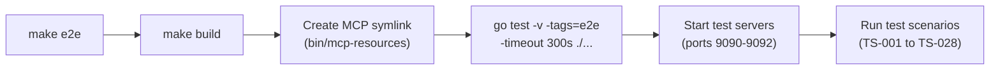
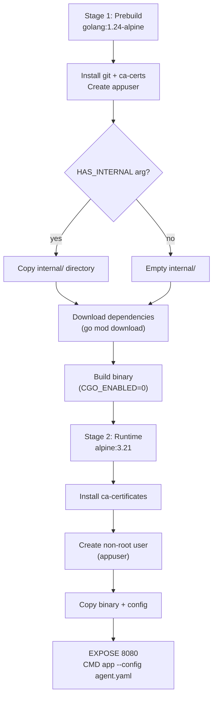
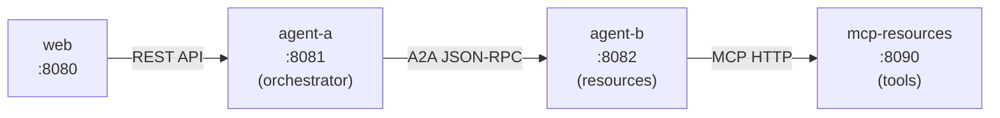

# DevOps and Development Toolchain

## Build System

The project uses a comprehensive **Makefile** that auto-detects the project structure (multi-command `cmd/` layout) and supports cross-platform builds.

### Build Targets

| Target | Description |
|--------|-------------|
| `make build` | Build all binaries for the current platform into `bin/` |
| `make build-all` | Build for all platforms: linux-amd64, darwin-amd64, darwin-arm64 |
| `make rebuild` | Clean and rebuild for current platform |
| `make clean` | Remove the `bin/` directory |
| `make clean-all` | Remove `bin/`, `go.mod`, and `go.sum` |

### Build Outputs

Binaries are placed in `bin/` with platform suffixes:

```
bin/
├── agent-darwin-arm64          # macOS Apple Silicon
├── agent-darwin-amd64          # macOS Intel
├── agent-linux-amd64           # Linux
├── mcp-resources-darwin-arm64
├── mcp-resources-linux-amd64
├── web-darwin-arm64
├── web-linux-amd64
└── mcp-resources               # symlink (created by make e2e)
```

The Makefile auto-detects all subdirectories under `cmd/` and builds each one. For this project, it builds three binaries: `agent`, `web`, and `mcp-resources`.

### Running Locally

```bash
# Run the agent (default: config/agent.yaml)
make run CMD=agent

# Run with custom arguments
make run CMD=agent ARGS="--config config/my-agent.yaml"

# Run the web frontend
make run CMD=web
```

### Cross-Platform Launcher Scripts

`make build-all` generates launcher scripts (`bin/*.sh`) that auto-detect the platform and execute the correct binary:

```bash
# After build-all, use the launcher:
./bin/agent.sh --config config/agent.yaml
```

## Testing Strategy

The project uses a **two-tier testing strategy**: minimal unit tests for core packages and comprehensive E2E tests that validate the full request flow.

### Unit Tests

```bash
make test
# or
go test -v ./...
```

Unit tests exist for the following packages:

| Package | File | Coverage Focus |
|---------|------|----------------|
| `internal/auth` | `auth_test.go` | Bearer token and session ID context propagation |
| `internal/config` | `config_test.go` | YAML config loading and default values |
| `internal/conversation` | `conversation_test.go` | Message operations, approval lifecycle, thread safety |
| `internal/storage` | `storage_test.go` | JSON file persistence, conversation search |

Unit tests run without any external dependencies or API keys.

### E2E Tests

```bash
make e2e
# or
go test -v -tags=e2e -timeout 300s ./...
```

**Prerequisites:**
- `GEMINI_API_KEY` environment variable set
- Built MCP binary (`make build` runs automatically via `make e2e`)

**E2E test files:**

| File | Scope | Port(s) | Test IDs |
|------|-------|---------|----------|
| `e2e_test.go` | Single-agent scenarios | 9090 | TS-001 to TS-014, TS-020 |
| `e2e_orchestration_test.go` | Multi-agent orchestration | 9091-9092 | TS-022 to TS-028 |

**E2E test categories:**

- **Conversation lifecycle**: Create, list, get, send messages
- **Tool execution**: Non-destructive and destructive MCP tool calls
- **Approval workflow**: Approve, reject, multiple format support
- **A2A protocol**: Agent Card, message/send, tasks/get, approval via A2A
- **Orchestration**: Sequential, parallel, loop pipelines with MCP tools
- **Chain delegation**: A2A chain with proxy approval
- **Session tracing**: Custom session ID propagation

**Test configuration files** live in `testdata/`:

| File | Description |
|------|-------------|
| `testdata/e2e-sequential.yaml` | Sequential pipeline test config |
| `testdata/e2e-parallel.yaml` | Parallel pipeline test config |
| `testdata/e2e-loop.yaml` | Loop pipeline test config |
| `testdata/e2e-chain-a.yaml` | A2A chain orchestrator config |
| `testdata/e2e-chain-b.yaml` | A2A chain resource agent config |

E2E tests start real HTTP servers on dedicated ports (9090-9092) and make actual LLM API calls to Gemini.

### Test Execution Flow



## Code Quality Tools

### Linting

```bash
make lint
```

Uses `golangci-lint` with the following linters enabled (`.golangci.yml`):

| Linter | Purpose |
|--------|---------|
| `errcheck` | Check for unchecked errors (with type assertion checking) |
| `gosimple` | Simplify code |
| `govet` | Report suspicious constructs (with shadow variable detection) |
| `ineffassign` | Detect ineffectual assignments |
| `staticcheck` | Advanced static analysis |
| `unused` | Find unused code |
| `gofmt` | Enforce standard formatting |
| `goimports` | Enforce import ordering |
| `misspell` | Find misspelled words |
| `unconvert` | Remove unnecessary type conversions |
| `unparam` | Find unused function parameters |

If `golangci-lint` is not installed, `make lint` falls back to `go vet`.

### Formatting

```bash
make fmt
```

Runs `go fmt ./...` to enforce standard Go formatting.

### Vet

```bash
make vet
```

Runs `go vet ./...` for suspicious code constructs.

### All Checks

```bash
make check
```

Runs all quality checks in sequence: `fmt` -> `vet` -> `lint` -> `test`.

## Docker Build

### Dockerfile Architecture

The project uses a **multi-stage Docker build** with conditional stages for flexible per-binary image creation:



**Build details:**

- All binaries use `CGO_ENABLED=0` (SQLite uses `modernc.org/sqlite`, a pure Go driver -- no CGO required)
- All binaries use `-ldflags="-w -s"` to strip debug info and reduce size
- The build image is `golang:1.24-alpine`
- The runtime image is `alpine:3.21` (minimal Alpine Linux)
- Only `ca-certificates` is installed in the runtime image
- The `GO_BIN` build arg selects which binary to build (agent, web, mcp-resources)
- The `HAS_INTERNAL` build arg controls whether `internal/` is copied (not needed for mcp-resources)

### Docker Compose

The `docker-compose.yaml` defines a four-service stack:



| Service | Config File | Port (host:container) | Role |
|---------|------------|------|------|
| `mcp-resources` | `config/mcp-resources-compose.yaml` | 8090:8080 | MCP Streamable HTTP server (SQLite resources) |
| `agent-b` | `config/agent-b.yaml` | 8082:8080 | Resource agent, connects to mcp-resources |
| `agent-a` | `config/agent-a.yaml` | 8081:8080 | Orchestrator, delegates to agent-b via A2A |
| `web` | `config/web-compose.yaml` | 8080:8080 | Browser-based chat UI |

**Startup order**: `mcp-resources` -> `agent-b` -> `agent-a` -> `web` (enforced by `depends_on` with health checks).

**Volumes:**

| Volume | Service | Purpose |
|--------|---------|---------|
| `mcp-resources-data` | mcp-resources | Persistent SQLite database storage |
| `agent-a-data` | agent-a | Persistent conversation storage |
| `agent-b-data` | agent-b | Persistent conversation storage |
| `./logs` | all | Shared log directory (bind mount) |

## Logging

### Request Logging

The Fiber web framework logs every request with the following format:

```
${time} | ${status} | ${latency} | ${method} | ${path} | sid=${locals:session_id}
```

Example:

```
16:23:45 | 200 | 1.234s | POST | /conversations/abc/messages | sid=a1b2c3d4
```

### Docker Compose Log Correlation

When running via `make compose-up`, each service writes its output to `./logs/` with a shared timestamp prefix:

```
logs/
├── 20260213_143022_a1b2c3d4_mcp-resources.log
├── 20260213_143022_a1b2c3d4_agent-a.log
├── 20260213_143022_a1b2c3d4_agent-b.log
└── 20260213_143022_a1b2c3d4_web.log
```

The `LOG_SESSION` variable (generated from timestamp + random hex) prefixes all log files for a single run.

Session IDs (`sid=`) in logs enable cross-agent request tracing:

```bash
# Trace a single request across all agents
grep "sid=a1b2c3d4" logs/*
```

## Dependency Management

### Go Modules

Dependencies are managed via `go.mod`. The project uses minimal dependencies:

| Dependency | Version | Purpose |
|------------|---------|---------|
| `github.com/gofiber/fiber/v2` | v2.52.10 | HTTP web framework |
| `github.com/google/uuid` | v1.6.0 | UUID generation |
| `modernc.org/sqlite` | v1.45.0 | SQLite driver (pure Go, no CGO) |
| `github.com/mark3labs/mcp-go` | v0.43.2 | MCP Streamable HTTP client library |
| `gopkg.in/yaml.v3` | v3.0.1 | YAML configuration parsing |

### Updating Dependencies

```bash
go mod tidy
go mod download
```

Or use the Makefile:

```bash
make init-deps
```

## CI/CD

This project does not have a CI/CD pipeline. All checks are run locally:

```bash
# Full validation pipeline
make check    # fmt + vet + lint + test (unit)
make e2e      # E2E tests (requires GEMINI_API_KEY)
```

For projects that need CI, the `make check` and `make e2e` targets can be directly integrated into any CI system (GitHub Actions, GitLab CI, etc.).
