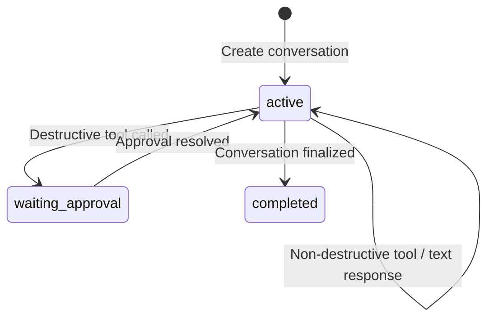
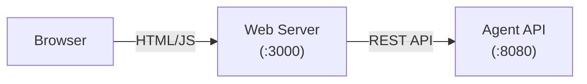

# Functionalities

This document covers every feature of Agent Stop and Go in detail, including configuration options, behavior, and usage examples.

## Multi-LLM Support

The system supports multiple LLM providers with automatic routing based on model name prefix.

### Provider Routing

| Provider | Model Prefix | Example Models | Env Variable |
|----------|-------------|----------------|-------------|
| Google Gemini | (default, any non-`claude-*`) | `gemini-2.5-flash`, `gemini-2.5-pro` | `GEMINI_API_KEY` |
| Anthropic Claude | `claude-*` | `claude-sonnet-4-5-20250929` | `ANTHROPIC_API_KEY` |

The routing logic is in `internal/llm/client.go`:

```go
func NewClient(model string) (Client, error) {
    if strings.HasPrefix(model, "claude-") {
        return NewClaudeClient(model)
    }
    return NewGeminiClient(model)
}
```

### LLM Client Interface

All providers implement the same interface:

```go
type Client interface {
    GenerateWithTools(ctx context.Context, systemPrompt string, messages []Message, tools []mcp.Tool) (*Response, error)
}
```

### Model Configuration

The default model is set at the top level. Individual orchestration nodes can override it:

```yaml
llm:
  model: gemini-2.5-flash  # default for all nodes

agent:
  type: sequential
  agents:
    - name: analyzer
      type: llm
      model: claude-sonnet-4-5-20250929  # overrides default (uses Anthropic)
    - name: executor
      type: llm
      # inherits gemini-2.5-flash from llm.model
```

### Timeout

All LLM HTTP clients use a **60-second timeout**.

### Max Tokens

- **Gemini**: No explicit max tokens (uses API default)
- **Claude**: Fixed at 4096 tokens per request

## MCP Tool Execution

### Protocol

MCP (Model Context Protocol) tools communicate via JSON-RPC 2.0 over stdio. The agent launches an MCP server binary as a subprocess and communicates through stdin/stdout pipes.

### Lifecycle

1. **Start**: The MCP binary is launched with configured command and args
2. **Initialize**: The agent sends an `initialize` request and `notifications/initialized`
3. **Tool Discovery**: The agent calls `tools/list` to load available tools
4. **Tool Execution**: During message processing, the agent calls `tools/call` as needed
5. **Stop**: On shutdown, the agent closes stdin and kills the process

### Tool Discovery

Each tool returned from `tools/list` has:

| Field | Type | Description |
|-------|------|-------------|
| `name` | string | Unique tool identifier |
| `description` | string | What the tool does (shown to the LLM) |
| `inputSchema` | object | JSON Schema for the tool's parameters |
| `destructiveHint` | boolean | If `true`, triggers the approval workflow |

### Built-in MCP Server: mcp-resources

The included `mcp-resources` binary provides a SQLite-backed resource management tool:

| Tool | Description | destructiveHint | Parameters |
|------|-------------|-----------------|------------|
| `resources_add` | Add a new resource | `true` | `name` (string, required), `value` (integer, required) |
| `resources_remove` | Remove resources by ID or name pattern | `true` | `id` (string), `pattern` (string, regex) |
| `resources_list` | List resources, optionally filtered | `false` | `pattern` (string, regex, optional) |

### Custom MCP Servers

Any binary that speaks MCP JSON-RPC 2.0 over stdio can be used:

```yaml
mcp:
  command: /path/to/my-mcp-server
  args:
    - --flag1
    - value1
```

The binary must implement:

- `initialize` -- return server info and capabilities
- `notifications/initialized` -- accept the notification (no response)
- `tools/list` -- return available tools with schemas and destructiveHint
- `tools/call` -- execute a tool and return the result

### Thread Safety

MCP tool calls are serialized via `Agent.mcpMu` (a `sync.Mutex`). This ensures correctness when parallel orchestration nodes call MCP tools concurrently on the same subprocess.

## A2A Protocol

### A2A Client (Outbound)

A2A agents are configured in `config/agent.yaml`. They appear as **synthetic tools** to the LLM with the prefix `a2a_` (e.g., `a2a_summarizer`). The LLM naturally picks between MCP tools and A2A agents based on the task description.

```yaml
a2a:
  - name: summarizer
    url: https://summarizer.example.com
    description: "Summarizes texts"
    destructiveHint: false
  - name: deployer
    url: https://deployer.example.com
    description: "Deploys applications"
    destructiveHint: true  # will require approval
```

**Key behaviors:**

- Bearer tokens from incoming requests are forwarded in the `Authorization` header
- Session IDs are forwarded in the `X-Session-ID` header
- A2A HTTP client uses a 60-second timeout
- The A2A endpoint URL is used directly for `POST` (JSON-RPC) requests

### A2A Server (Inbound)

The agent exposes itself as an A2A-compliant server:

| Endpoint | Method | Description |
|----------|--------|-------------|
| `GET /.well-known/agent.json` | HTTP GET | Returns the Agent Card (name, description, skills) |
| `POST /a2a` | JSON-RPC 2.0 | Accepts `message/send` and `tasks/get` methods |

**Agent Card** -- Skills are derived from the agent's MCP tools and A2A agents:

```json
{
  "name": "resource-manager",
  "description": "A resource management agent...",
  "url": "http://0.0.0.0:8080",
  "skills": [
    {"id": "resources_add", "name": "resources_add", "description": "..."},
    {"id": "resources_list", "name": "resources_list", "description": "..."}
  ]
}
```

**Task ID mapping**: Task ID = Conversation ID. Each A2A task corresponds to exactly one conversation.

### Task States

| State | Meaning |
|-------|---------|
| `completed` | Task finished successfully |
| `input-required` | Task waiting for approval (destructive operation pending) |

### A2A Approval via Message

When a task is in `input-required` state, approval can be sent via `message/send` with `taskId`:

```json
{
  "jsonrpc": "2.0",
  "id": 1,
  "method": "message/send",
  "params": {
    "taskId": "conversation-uuid",
    "message": {
      "role": "user",
      "parts": [{"type": "text", "text": "approved"}]
    }
  }
}
```

**Recognized approval words**: `yes`, `y`, `true`, `approve`, `approved`, `ok`, `confirm`

## Approval Workflow

### How It Works

1. The LLM calls a tool or A2A agent with `destructiveHint=true`
2. Instead of executing, the system creates a `PendingApproval` with a UUID
3. The conversation status changes to `waiting_approval`
4. The response includes the approval UUID and a description of the pending action
5. The client submits approval or rejection via `POST /approvals/:uuid`
6. On approval: the tool executes and the result is returned
7. On rejection: the operation is cancelled and the conversation returns to `active`

### PendingApproval Structure

| Field | Description |
|-------|-------------|
| `uuid` | Unique approval identifier |
| `conversation_id` | Parent conversation |
| `tool_name` | The tool that was called |
| `tool_args` | Arguments passed to the tool |
| `description` | Human-readable description of the action |
| `remote_task_id` | For proxy approvals: the downstream agent's task ID |
| `remote_agent_name` | For proxy approvals: the downstream agent's name |

### Approval Request Formats

The REST API accepts multiple formats for flexibility:

```json
{"approved": true}
{"action": "approve"}
{"answer": "yes"}
```

Rejection:

```json
{"approved": false}
{"action": "reject"}
{"answer": "no"}
```

### Proxy Approval Chain

When Agent A delegates to Agent B via A2A and Agent B returns `input-required`:

1. Agent A creates a **proxy** `PendingApproval` with `remote_task_id` and `remote_agent_name`
2. When the proxy is approved, Agent A forwards the approval to Agent B via `message/send` with `taskId`
3. Agent B executes the tool and returns the result through the chain

This enables multi-hop approval chains where the human only interacts with the top-level agent.

## Agent Orchestration

The orchestration engine enables complex multi-step agent workflows defined as a tree in YAML configuration.

### When Orchestration Activates

- If the `agent` key is present in config, the tree-based orchestrator is used
- If absent, the agent runs in simple single-LLM mode (backward compatible)
- If `agent` is a single `llm` node with no children, it behaves like simple mode

### Node Types

#### Sequential

Executes children in order. If a child triggers an approval, the **entire pipeline pauses**. After the approval is resolved, execution resumes from the exact child that was paused.

```yaml
agent:
  type: sequential
  agents:
    - name: step1
      type: llm
      output_key: result1
      prompt: "Analyze the request"
    - name: step2
      type: llm
      prompt: "Execute based on {result1}"
```

#### Parallel

Executes all children concurrently. Results are collected in order. **Destructive tools execute immediately** within parallel nodes (no approval pause).

```yaml
agent:
  type: parallel
  agents:
    - name: fetch-data
      type: llm
      output_key: data
    - name: fetch-metadata
      type: llm
      output_key: metadata
```

#### Loop

Repeats children until `exit_loop` is called or `max_iterations` is reached. **Destructive tools execute immediately** within loop nodes. Default safety cap: 10 iterations.

```yaml
agent:
  type: loop
  max_iterations: 5
  agents:
    - name: checker
      type: llm
      can_exit_loop: true
      prompt: "List resources. If 3+ exist, call exit_loop."
```

#### LLM

Sends a prompt to an LLM with MCP tools and optional node-level A2A tools. Supports `output_key`, `can_exit_loop`, and per-node `a2a` tools.

```yaml
- name: analyzer
  type: llm
  model: gemini-2.5-flash
  output_key: analysis
  can_exit_loop: true
  a2a:
    - name: validator
      url: http://validator:8082/a2a
      description: "Validates results"
  prompt: "Analyze: {user_message}"
```

#### A2A

Delegates to a remote A2A agent as a workflow step. The prompt is used as the message template.

```yaml
- name: resource-agent
  type: a2a
  url: http://agent-b:8082/a2a
  prompt: "{analysis}"
  output_key: result
  destructiveHint: false
```

### Node Configuration Reference

| Field | Applicable Types | Description |
|-------|-----------------|-------------|
| `name` | all | Node identifier (required) |
| `type` | all | `llm`, `sequential`, `parallel`, `loop`, `a2a` |
| `agents` | sequential, parallel, loop | Sub-agent list |
| `model` | llm | LLM model name. Defaults to top-level `llm.model` |
| `prompt` | llm, a2a | System prompt or message template with `{placeholders}` |
| `output_key` | llm, a2a | Key to store output in session state |
| `can_exit_loop` | llm | Gives the node an `exit_loop` tool |
| `max_iterations` | loop | Max iterations (default: 10 safety cap) |
| `url` | a2a | Remote agent URL |
| `description` | a2a | Agent description |
| `destructiveHint` | a2a | Requires approval before delegation |
| `a2a` | llm | Per-node A2A tools for LLM decision |

### Session State

Nodes communicate via a shared `SessionState` map:

- **`output_key`**: A node stores its response text under this key
- **`{placeholder}`**: In `prompt`, `{key}` is replaced with the stored value at runtime
- **Thread safety**: `SessionState` uses `sync.RWMutex` for safe parallel access

### Pipeline Pause/Resume

When a sequential pipeline pauses for approval:

1. The current session state is serialized into `PipelineState`
2. The paused node's path (array of child indices) is recorded
3. On resume, the orchestrator fast-forwards to the paused node using the path
4. Execution continues from where it left off

## Conversation Lifecycle

### States



### Persistence

Conversations are stored as individual JSON files:

```
data/
├── conversation_abc123-def456.json
├── conversation_789ghi-jkl012.json
└── ...
```

File naming: `conversation_{uuid}.json`

Each file contains the full conversation state: messages, pending approval, pipeline state, and metadata. Files are written atomically via `os.WriteFile`.

### Message Roles

| Role | Description |
|------|-------------|
| `system` | System prompt (set on conversation creation, not sent to LLM as a message) |
| `user` | User messages and approval decisions |
| `assistant` | Agent responses, tool call descriptions, error messages |
| `tool` | Tool execution results (not sent to LLM) |

## Web Chat Frontend

The web chat (`cmd/web`) provides a browser-based interface for interacting with the agent.

### Architecture

The web frontend is a separate Go binary that proxies requests to the agent's REST API. It does **not** use the A2A protocol (which is reserved for agent-to-agent communication).



### Configuration

```yaml
# config/web.yaml
agent_url: http://localhost:8080
host: 0.0.0.0
port: 3000
```

### Routes

| Route | Description |
|-------|-------------|
| `GET /` | Chat UI (embedded HTML/CSS/JS) |
| `POST /api/send` | Send message (proxies to agent REST API) |
| `POST /api/approve` | Approve/reject (proxies to `POST /approvals/:uuid`) |
| `GET /api/conversation/:id` | Get conversation state |

## REST API Reference

### Health Check

```
GET /health
```

Response: `{"status": "ok"}`

### List Tools

```
GET /tools
```

Returns all MCP tools and A2A agents available to the agent.

### Create Conversation

```
POST /conversations
Content-Type: application/json

{"message": "optional initial message"}
```

If a message is provided, it is processed immediately. Otherwise, an empty conversation is created.

### List Conversations

```
GET /conversations
```

Returns all conversations with a summary of status counts (active, waiting_approval, completed).

### Get Conversation

```
GET /conversations/:id
```

Returns a single conversation by ID.

### Send Message

```
POST /conversations/:id/messages
Content-Type: application/json

{"message": "list resources"}
```

Processes the user message. May return a direct response or an approval request.

### Resolve Approval

```
POST /approvals/:uuid
Content-Type: application/json

{"approved": true}
```

Approves or rejects a pending destructive action.

### Interactive Documentation

```
GET /docs
```

Returns an interactive HTML page documenting all API endpoints with examples.

## Configuration Reference

### Full Configuration Schema

```yaml
# Agent identity (used in A2A Agent Card)
name: resource-manager          # Default: "agent"
description: "Agent description" # Default: ""

# System prompt (simple mode only; ignored in orchestrated mode)
prompt: |
  Your agent's system prompt here...

# Server settings
host: 0.0.0.0                  # Default: "0.0.0.0"
port: 8080                      # Default: 8080
data_dir: ./data                # Default: "./data"

# LLM settings
llm:
  model: gemini-2.5-flash       # Default: "gemini-2.5-flash"

# MCP server (required)
mcp:
  command: ./bin/mcp-resources   # Path to MCP binary
  args:                          # Arguments passed to the binary
    - --db
    - ./data/resources.db

# A2A sub-agents (optional, simple mode)
a2a:
  - name: summarizer
    url: https://summarizer.example.com
    description: "Summarizes texts"
    destructiveHint: false

# Agent tree (optional; presence activates orchestrated mode)
agent:
  name: pipeline
  type: sequential
  agents:
    - name: step1
      type: llm
      output_key: result
      prompt: "Analyze..."
    - name: step2
      type: llm
      prompt: "Execute based on {result}"
```

### Environment Variables

| Variable | Required | Description |
|----------|----------|-------------|
| `GEMINI_API_KEY` | Yes (for Gemini models) | Google Gemini API key |
| `ANTHROPIC_API_KEY` | Yes (for Claude models) | Anthropic Claude API key |

### Command-Line Flags

| Binary | Flag | Default | Description |
|--------|------|---------|-------------|
| `agent` | `--config` | `config/agent.yaml` | Path to agent configuration file |
| `web` | `--config` | `config/web.yaml` | Path to web configuration file |
| `mcp-resources` | `--db` | `./resources.db` | Path to SQLite database |
